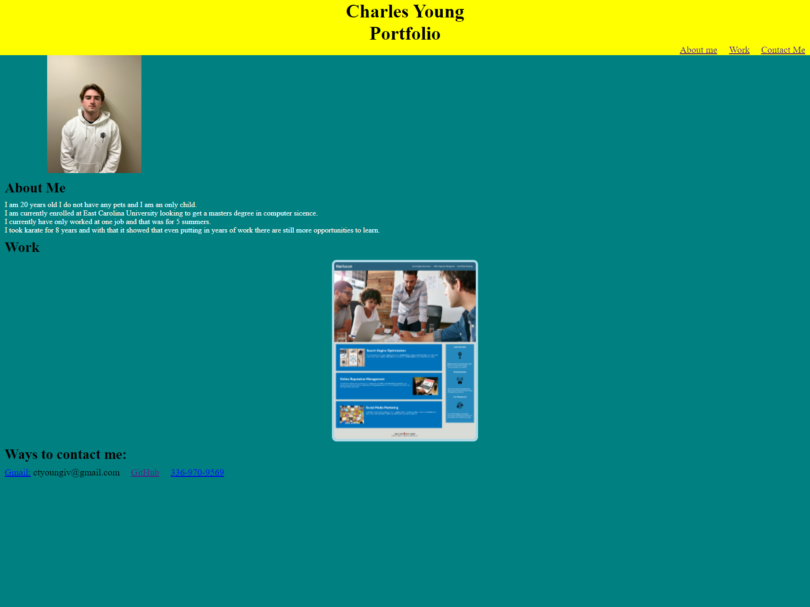

# portfolio

# Table of Contents
1. [Description](#description)
2. [Visuals](#visuals)
3. [Resources](#resources)

## Description

This assignmant was designed to make a portfolio where there is a task to show the reader what project i have accomplished and some information about me.

## Visuals

## Resources
- [Live Site](https://mortalmx13.github.io/portfolio/)

- [Respository](https://github.com/Mortalmx13/portfolio)
